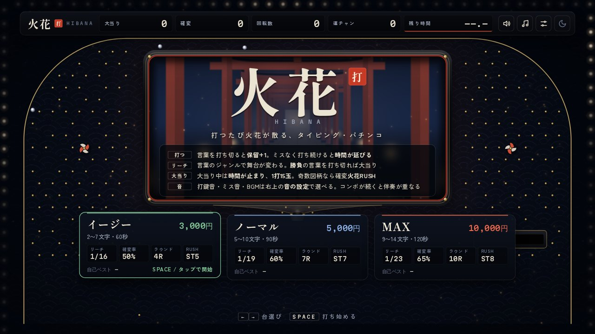
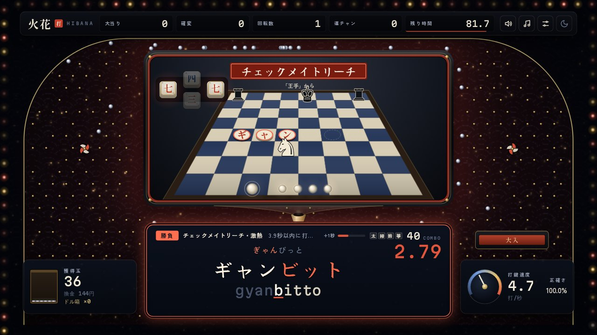

# 火花 HIBANA

▶ **遊ぶ：<https://tt9944307-bot.github.io/hibana/>**

ローマ字で言葉を打つと玉が飛び、火花が散るタイピングゲームです。
制限時間の中で、どれだけ速く正確に打てるかを競います。リーチや大当りといったパチンコの演出が、おまけで付いてきます。

ブラウザだけで遊べます。インストールや登録はいりません。

## 遊び方

- 台を選んで <kbd>SPACE</kbd> で始めます。表示された言葉をローマ字で打ちます。「し」は shi でも si でも打てるなど、よく使う書き方はどれでも通ります。
- 台は3つあります。

  | 台 | 制限時間 | 言葉の長さ |
  |---|---|---|
  | イージー | 60秒 | 2〜7文字 |
  | ノーマル | 90秒 | 5〜10文字 |
  | MAX | 120秒 | 9〜14文字 |

- ミスなく打ち続けると、28・59・93・130打目で制限時間が +1・+1・+2・+3秒 延びます。
- 言葉を打ち切ると保留がたまり、図柄が回ります。リーチになると「勝負」の言葉が出て、時間内に打ち切れば大当りです。大当り中は時計が止まります。

## 結果画面

- スコアは「1分あたりの正しい打鍵数 × 正確さの3乗」です。速さと正確さの両方が効きます。
- 同じ台の直近の記録と比べた「今回の調子」と、直近5回とその前の5回を比べた「実力の伸び」が出ます。スコアの推移のグラフと、ミスが多かったキーも見られます。
- 記録は遊んだブラウザの中にだけ保存されます。

## 操作

| キー | 動き |
|---|---|
| <kbd>SPACE</kbd> | 始める・もう一度 |
| <kbd>←</kbd> <kbd>→</kbd> | 台を選ぶ |
| <kbd>ESC</kbd> | 一時停止・台選びへ戻る |

- 日本語入力（IME）はオフにして、半角英数で打ってください。
- スマートフォンでは、画面をタップするとキーボードが出ます。

## 音

右上の「音の設定」から、次のものを選べます。選ぶとその場で鳴り、キーボードで試し打ちもできます。

- 打鍵音：メカニカル、リニア、クリッキー、静電容量、ノートPC、タイプライター、なし
- ミスの音、言葉を打ち切ったときの音
- BGM：和太鼓と箏、ローファイ、雨とピアノ、なし
- 打鍵の響き（なし・部屋・広間）と、4つの音量

音はすべてブラウザの中で合成していて、音声ファイルは使っていません。

## しくみ

- `index.html` の1ファイルだけで動きます。ビルドやサーバーはいりません。
- 画面は WebGL と Canvas、音は Web Audio API で作っています。
- 書体は Google Fonts から読み込んでいます（Shippori Mincho B1、Zen Kaku Gothic New、Yuji Syuku、Klee One、Martian Mono、Noto Sans Symbols 2。いずれも SIL Open Font License）。
